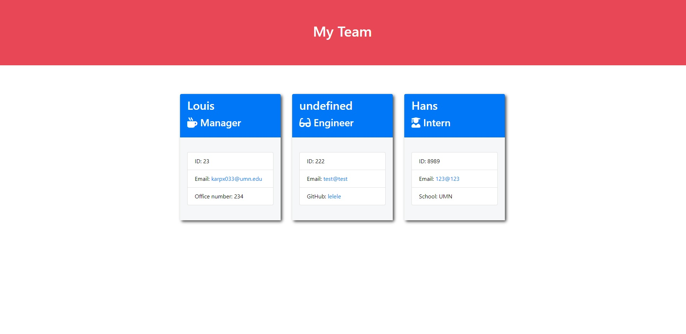

# Team Contact Generator

## Table of Contents

- [Description](#description)
- [Installation](#installation)
- [Usage](#usage)
- [Tests](#tests)
- [Contributing](#contributing)
- [Questions](#questions)

 ## Description

The purpose of the application is to This application allows the user to enter employee's contact information into the terminal and a nice looking HTML file will be generated from it.
 
## Video
(https://watch.screencastify.com/v/TNDu5cBwN4XE2J5KP1sy)

## Screenshot 

## Installation

Externally need Inquirer

## Usage

After installing Inquirer run "node index.js" in your terminal and follow the prompts

## Tests

Have not tested various screen sizes

## Contributing

Please don't

## Questions

My GitHub username is: karpx033

Link @ https://github.com/karpx033

Email: karpx033@umn.edu

Got Questions? 
Send me an email

